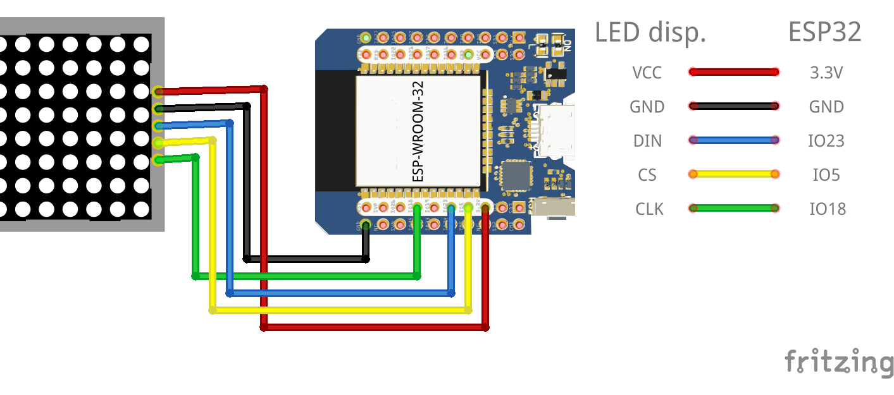
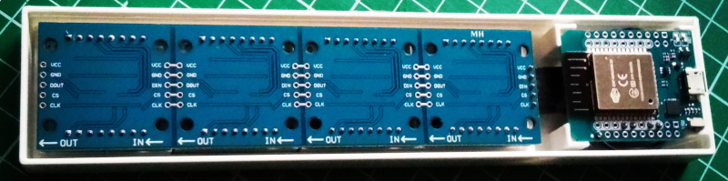

# Infotron

Simple info screen (e.g. LED matrix) displaying information from different web sources via wifi MCU (ESP32). This demo program allows you to display:
* time and date, 
* weather info, 
* custom text,
* or anything else you program it to display :wink:

Infotron runs its own little web server and web application that allows you to choose what to display. You can acces it via smartphone, tablet or notebook, by connecting directly to Infotron's access point (AP) or through your local network. Open your favorite browser and enter the IP address that Infotron scrolls at startup and have some fun _(Note: if you're not connecting to Infotron's AP, you'll have to find out the IP address it's assigned by your router first_).

## 1. Hardware

This project is built around two main components:
* [D1 MINI ESP32](https://www.diykits.eu/products/p_11918)
* [MAX7219 4-in-1 LED Matrix Display](http://www.diykits.eu/products/p_10987)

### 1.1. Wiring

Wiring is simple, follow the instructions in main.cpp, use fritzing file in _doc_ directory or the image below for reference:

You can solder the wires directly or use the provided angle headers and dupont wires for connection. Once in a box, it should look like this:

### 1.2. Box

The box is 3D printed, 3D model was made using [OpenSCAD](https://openscad.org/) and source files are in _model_ directory. Final version of STLs will be there too, you'll have to use OpenSCAD (it's free and open source) to generate STLs. It's recommended to print in PETG, but any other filament type should be fine.

## 2. Software

To change, compile and upload this firmware, you'll need [VS Code](https://code.visualstudio.com/) and [PlatformIO plugin](https://platformio.org/). Make sure to build the filesystem image of _data_ directory and upload it to the boards SPIFFS too, as it contains the web application files needed to control Infotron. You can find out more about it [here](https://esp32tutorials.com/esp32-esp-idf-spiffs-web-server/).

### 2.1. Dependencies

The libraries used:
* [MD_Parola library](https://github.com/MajicDesigns/MD_Parola) by Marco Colli ([MajicDesigns](https://github.com/MajicDesigns))
* [MD_MAX72xx library](https://github.com/MajicDesigns/MD_MAX72xx) by Marco Colli ([MajicDesigns](https://github.com/MajicDesigns))
* [ESP Async WebServer](https://github.com/me-no-dev/ESPAsyncWebServer?utm_source=platformio&utm_medium=piohome) by [Hristo Gochkov](https://github.com/me-no-dev)

## 3. Status

Demo program on main branch works for the hardware listed above. The old (unfinished) version based on ESP8266 board can be found on branch _esp8266_.
